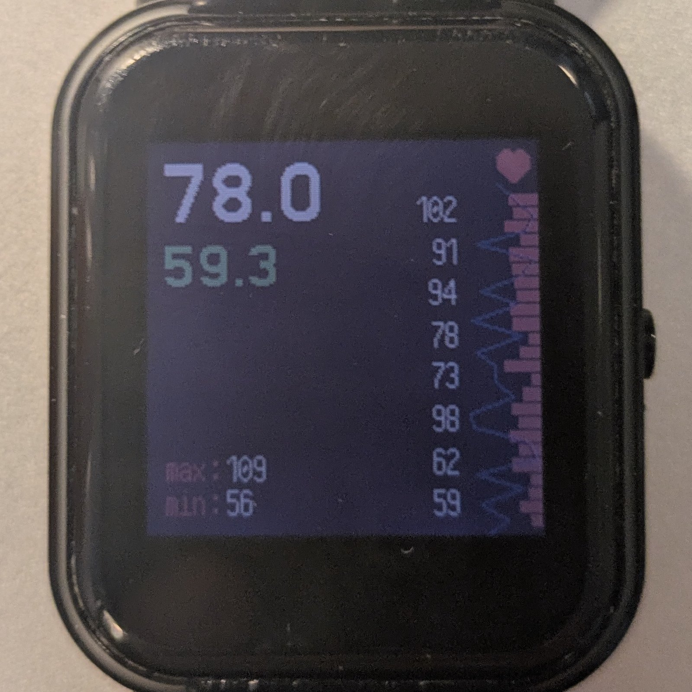
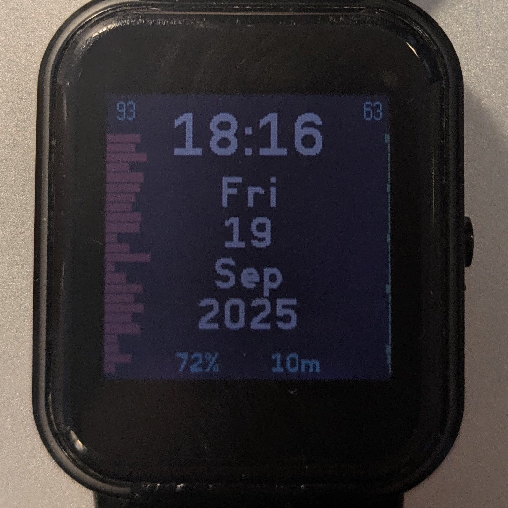
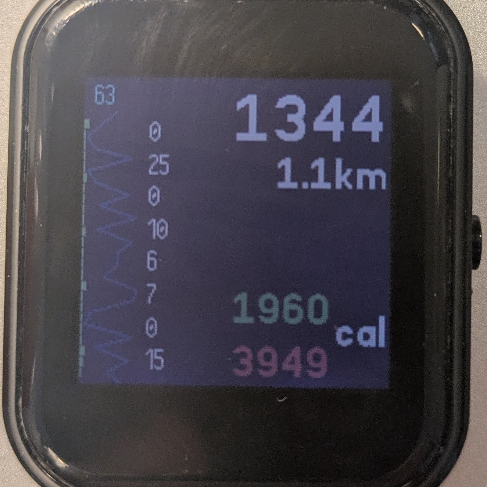
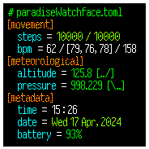
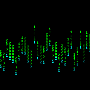
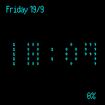

Repository containing watch faces, widgets, and apps for the BangleJS 2

# ScrollTime.js

A three-panel display 

- left panel shows heartrate data. 
- right panel shows stepcount and exercise data
- center panel combines the data and shows time information

Called scrolltime as you have to scroll to the left or to the right to view more information

Heartrate - Left | Time and Date - Center | Steps and calories - Right
:-------------------------:|:-------------------------:|:-------------------------:
 ||

I've been using this watch for several months and am generally happy, although still plenty of TODOs.

# DevTime.js

Displays information in a TOML format.

Static - a syntax-highlighted TOML formatted file which is actually the watch data

# Matrix.js

Animated - green characters fall, leaving behind the time in cyan.

First watch ever created, and the performance is terrible. This was never seriously deployyed.

## Useful Links for Development
// REFERENCE MANUAL
https://www.espruino.com/Reference

// performance 
https://www.espruino.com/Performance

// basic clock 
https://www.espruino.com/Bangle.js+Clock

// alternative to widgets on faces
https://www.espruino.com/Bangle.js+Clock+Info

// fast loading?
https://www.espruino.com/Bangle.js+Fast+Load

// convert images
https://www.espruino.com/Image+Converter

